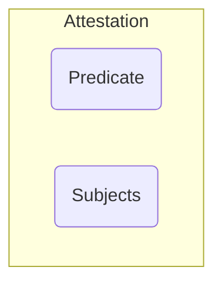

# The AMPEL Attestation Framework

AMPEL natively works with the in-toto attestation format. However, the policy
engine has its own attestation abstraction built on top of the in-toto format
to support more signing formats and wrappers.

## How AMPEL Abstracts Attestations

The in-toto attestation format breaks an attestation into two main parts: the
subjects and the predicate. The subjects are the pieces of software that the
attestation refers to, while the predicate describes what is being claimed or
asserted about those subjects.

Usually, subjects are software artifacts, but anything that can be represented
as a hash can be a subject including git commits or manifests. On the other hand,
the attestation predicate will usually be a known format but can be any valid JSON.

### Wrappers

Attested data may come wrapped in an envelope. Envelopes can be used to sign 
attested data, bundle more thatn one attestation and other reasons.

#### Signed Envelopes

Attestations will most often be wrapped in a signed envelope. Natively, AMPEL
supports attestations wrapped in DSSE (dead-simple signing envelope) and sigstore
bundles.

##### DSSE Envelopes

The simplest attestation envelope is DSSE. This is a thin layer around an in-toto
statement adding a signature and information about the key used to sign it.

##### Sigstore Bundles

Sigstore bundles wrap the attested data not just with their certificate and
signature, but also all the verification material required to verify the signature.

#### The "Bare" Envelope

To keep the model consistent, when ingesting non-signed data, AMPEL synthesizes
a _bare_ envelope. When parsing unsigned attestations ampel returns them with a
"bare" envelope to ensure all methods still work on them.

> [!IMPORTANT]
> A key notion to understand is that when performing an evaluation, AMPEL
> _peels off_ the attestation and only exposes the predicate to the evaluation
> engine. AMPEL processes and exposes to the runtime some of the attestation
> attributes such as the subject and the signer identities but only the data
> of the predicate gets loaded raw.

### Attestation Contents

#### Subjects

In-toto attestations can have more than one "subject" - a hash of whatever the
attestation is referring to. Note that while it is possible to write a
ResourceDescriptor without digests (hashes), AMPEL can only evaluate on hashes.

Evaluations can only be performed on one of the subjects at a time. Ampel can
take a hash or a file as subject in its command line but when specifying a file,
all hashes in the attestation subject must match the file.

#### Predicates

Predicates are the claims being done about the subjects. Any valid json can be
a predicate but most often attestations will contain data conforming to one
of the numerous standard supply chain security formats.

## Reading Attestations

Before executing a policy's tenets, AMPEL will read and select the attestations
required by the policy as specified in its predicate spec. From all the available
attestations, only those that meet the type specification and subject will be exposed
to the runtime.

The attestation format is defined by its _predicate type_ which is a versioned
URL. AMPEL policies specify what kind of data they need by enumerating one or more
predicate types.

Predicate specs may select a specific predicate type version or specify the type
without a version to force AMPEL to select all attestations of that type,
regardless of version.

### Collectors

Attestations can be read from different sources which are accessed by _collectors_.
The AMPEL attestation framework comes with some built-in collectors that can
read attestations from directories, software releases, OCI registries, etc. 
Collectors are plug-ins and more can be added.

### Queries and Filters

Internally, collectors use attestation _queries_ to select the required attestations
for a policy event. If a collector's backend cannot select attestations based on
their properties (for example when reading plain files), it can use AMPEL's filtering
capabilities in a query to find the data it needs. 

## Signatures and Identities

As mentioned, attestations can be wrapped in signed envelopes. But it is important
to differentiate between the signature providing authenticity and inegrity guarantees
and the _signing identity_.

When loading a signed attestation, AMPEL will verify an attestation's signature
automatically. If the signature fails, the attestation will be rejected.

But when it comes to the signing identity, AMPEL does not do any assumptions. It is
up to the policy to define who can sign attestations. _Who_ in this context refers
to a key or sigstore identity, or a mix of both.

## Attestation Tooling

The AMPEL ecosystem includes tools to work with attested data. 

### bnd

Bnd (pronounced "bind") is a tool that tries to be the Swiss Army knife to
work with attestations. Bnd can sign, verify and explore the contents of
attestations, as well a attest any file committed to a git repository.

bnd can be downloaded from https://github.com/carabiner-dev/bnd
